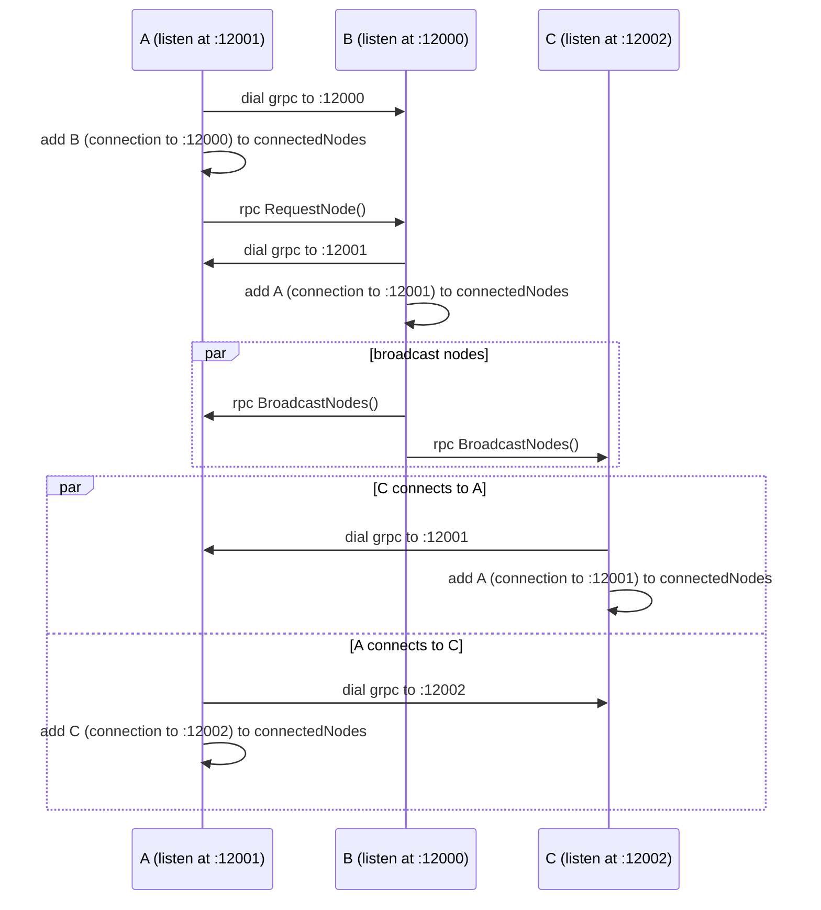

## Connection
We will establish two connections between two nodes, as gRPC acts like client-server mode.
For example, we will maintain A->B connection in A's connectedNodes and B->A connection in B's connectedNodes.

